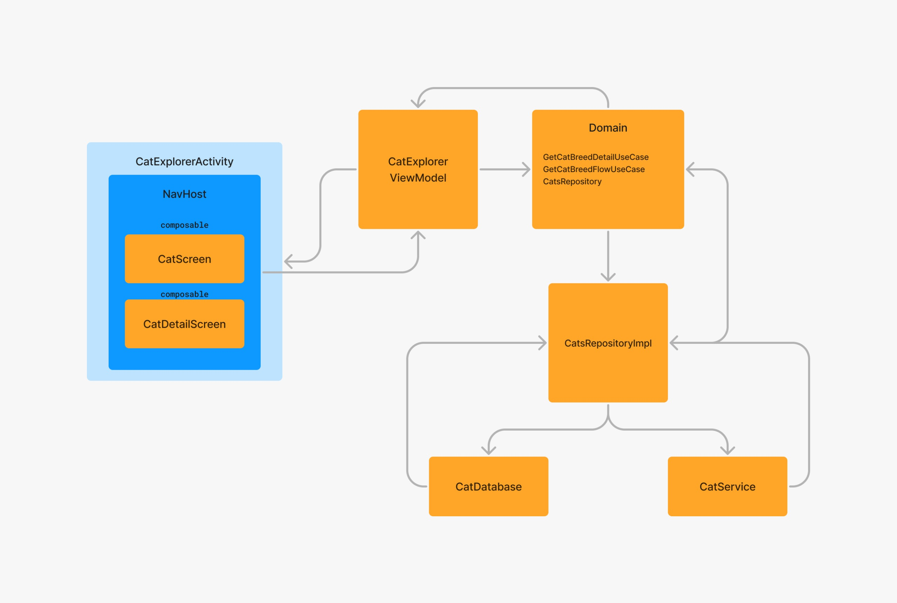
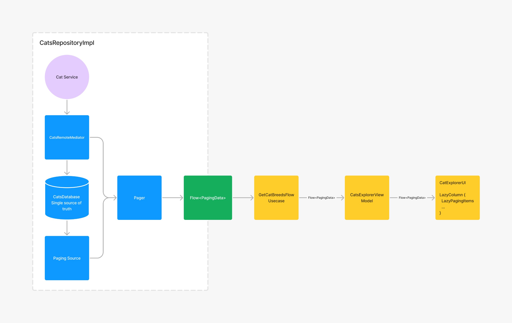
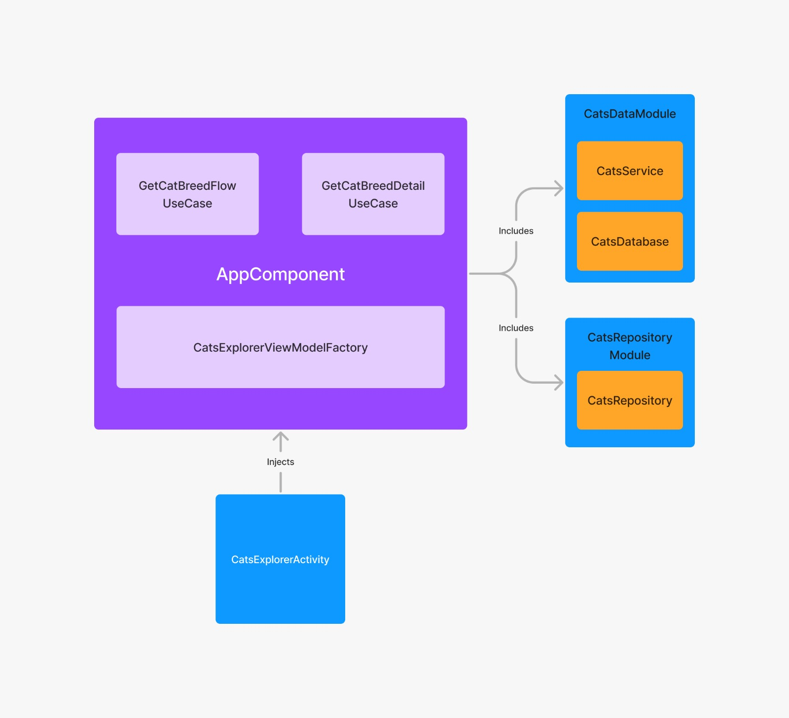

# Cat Explorer Android App

The Cat Explorer application is a Jetpack Compose UI-based app designed to showcase a list of cat breeds along with their distinct features. Built using the MVVM architecture and incorporating principles of clean architecture, this app ensures maintainability, scalability, and separation of concerns. 

## Features

- View a list of cat breeds with their title and short description which is truncated after 5 lines.
- Tap on a cat breed to view detailed information and distinct features of it.

## Architecture

The app follows the MVVM (Model-View-ViewModel) architecture pattern, ensuring a clear separation of concerns and facilitating testability and maintainability. Additionally, it incorporates principles of clean architecture, which promotes a modular and scalable codebase. The benefits of clean architecture include:

- Improved code organization and readability.
- Ease of testing, as business logic is isolated from external dependencies.
- Flexibility to adapt and extend the app's functionality without disrupting existing components.

  

## Pagination Support

To optimize the fetching of cat breed data from the server, the app leverages the Paging3 library for pagination support. Pagination ensures that data is loaded in batches, improving app performance and user experience. Benefits of pagination include:

- Efficient memory usage, as data is loaded incrementally rather than all at once.
- Smoother user experience, with faster loading times and reduced network usage.
- Simplified implementation of infinite scrolling and lazy loading features.

  

## Dependency Injection

For dependency injection, the app utilizes Dagger 2, a powerful and widely-used dependency injection framework for Android development. Dependency injection offers several benefits, including:

- Decoupling of dependencies, making it easier to manage and update components independently.
- Improved code maintainability and readability, with clearer separation of concerns.
- Enhanced testability, as dependencies can be easily replaced or mocked during unit testing.

  

## Getting Started

To get started with the Cat Explorer app, simply clone the repository and open it in Android Studio. Ensure that you have the latest version of Android Studio installed, along with the necessary SDK components. 
- Generate the Cats API key from https://thecatapi.com/
- In local.properties, add CATS_API_KEY= "your_api_key"
- Build, run, and explore the app on your local device or emulator.
